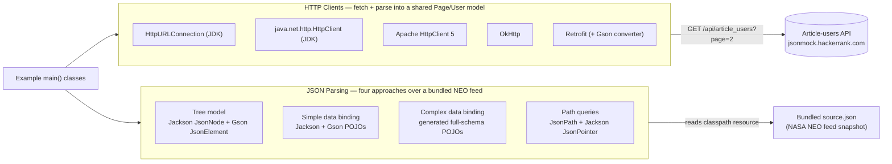

[](https://github.com/AndriyKalashnykov/maven-simple/actions/workflows/ci.yml)
[](https://hits.sh/github.com/AndriyKalashnykov/maven-simple/)
[](https://opensource.org/licenses/MIT)
[](https://app.renovatebot.com/dashboard#github/AndriyKalashnykov/maven-simple)

# Referencia de Clientes HTTP y Análisis JSON en Java

Comparación lado a lado de cinco clientes HTTP de Java (`HttpURLConnection`, `java.net.http.HttpClient`, Apache HttpClient 5, OkHttp, Retrofit) y cuatro enfoques de análisis JSON (modelo en árbol, enlace de datos simple, enlace de datos de esquema completo, consultas por ruta) — **dos vías de demostración independientes**. Cada cliente HTTP realiza la misma solicitud `GET /api/article_users?page=2` y la analiza en un modelo compartido, por lo que las compensaciones del cliente (ergonomía, huella de dependencias, soporte asíncrono) son directamente comparables; cada demostración de análisis JSON procesa la misma instantánea incluida del feed de Objetos Cercanos a la Tierra (NEO) de la NASA, por lo que las compensaciones de análisis (manejo de esquemas, ergonomía de consultas) son directamente comparables. También funciona como referencia de herramientas de compilación: una pirámide de pruebas de **JUnit 6 + WireMock**, comprobaciones de calidad y seguridad de **google-java-format / gitleaks / Trivy / OWASP dependency-check**, cumplimiento de cobertura del 70 % con **JaCoCo** y una canalización de CI de **GitHub Actions** (reproducible localmente mediante `act`) en una cadena de herramientas fijada con **mise** con dependencias gestionadas por **Renovate**.



Las dos áreas son **independientes**. Cada clase `main()` bajo `http/client/{java,apache,okhttp,retrofit}` (sobre un modelo compartido `http/client/model`) realiza `GET /api/article_users?page=2` contra una API pública de artículo-usuarios y analiza el JSON en `Page`/`User`. Por separado, cada `main()` bajo `jsonparse/{treemodels,databinding/simple,databinding/complex,pathqueries}` analiza el `src/main/resources/source.json` incluido (una instantánea del feed NEO de la NASA) — sin llamadas a la red. Las versiones de las bibliotecas se encuentran en la tabla de Pila Tecnológica a continuación; el diagrama las omite intencionalmente para que nunca se desvíe de la compilación.

## Pila Tecnológica

| Componente | Tecnología |
|-----------|------------|
| Lenguaje | Java 25 LTS (Temurin vía [mise](https://mise.jdx.dev/)) |
| Compilación | [Maven](https://maven.apache.org/) 3.9.16 (fijado vía `.mise.toml`; enforcer permite 3.6.3+) |
| Pruebas | [JUnit Jupiter](https://junit.org/junit5/) 6.1.1 (unitarias) + [WireMock](https://wiremock.org/) 3.13.2 (integración vía Failsafe `*IT.java`) |
| Cobertura | [JaCoCo](https://www.jacoco.org/jacoco/) (70 % de instrucciones + ramas) |
| Clientes HTTP | `java.net.HttpURLConnection`, `java.net.http.HttpClient`, [Apache HttpClient 5](https://hc.apache.org/) 5.6.1, [OkHttp](https://square.github.io/okhttp/) 5.4.0, [Retrofit](https://square.github.io/retrofit/) 3.0.0 |
| JSON | [Jackson](https://github.com/FasterXML/jackson) 3.2.0 (`tools.jackson.core`), [Gson](https://github.com/google/gson) 2.14.0, [JsonPath](https://github.com/json-path/JsonPath) 3.0.0 |
| Formateo | [google-java-format](https://github.com/google/google-java-format) |
| Seguridad | [gitleaks](https://github.com/gitleaks/gitleaks), [Trivy](https://github.com/aquasecurity/trivy), [OWASP dependency-check](https://dependency-check.github.io/DependencyCheck/) |
| CI | GitHub Actions; reproducción local vía [act](https://github.com/nektos/act) |
| Automatización | [Renovate](https://docs.renovatebot.com/) (fusión automática vía su propia ejecución revalidada) |

## Inicio Rápido

```bash
make deps      # instala automáticamente mise + Java/Maven fijados en .mise.toml
make build     # compila el proyecto
make test      # ejecuta todas las pruebas
make ci        # o ejecuta la canalización CI completa (static-check, test, coverage-check, build)
```

## Requisitos Previos

| Herramienta | Versión | Propósito |
|------|---------|---------|
| [GNU Make](https://www.gnu.org/software/make/) | 3.81+ | Orquestación de compilación |
| [Git](https://git-scm.com/) | 2.0+ | Control de versiones, lanzamientos |
| [JDK](https://adoptium.net/) | 25+ | Entorno de ejecución y compilador de Java (fuente: `.java-version`) |
| [Maven](https://maven.apache.org/) | 3.6.3+ | Compilación y gestión de dependencias (3.9.16 fijado en `.mise.toml`) |
| [mise](https://mise.jdx.dev/) | última | Gestor de versiones de Java/Maven (instalado automáticamente por `make deps`) |
| [Docker](https://www.docker.com/) | última | Requerido por `act` para CI local |
| [act](https://github.com/nektos/act) | 0.2.89+ | Ejecutor de CI local para `make ci-run` (instalado vía `make deps-act`) |

Instalar todo:

```bash
make deps
```

## Arquitectura

Dos áreas de módulos independientes bajo `src/main/java/`:

### [Clientes HTTP](src/main/java/http/client)

| Implementación | Paquete | Notas |
|----------------|---------|-------|
| [HttpURLConnection](src/main/java/http/client/java/JavaHttpURLConnectionDemo.java) | `java.net` | JDK central, nivel bajo |
| [java.net.http.HttpClient](src/main/java/http/client/java/JavaHttpClientDemo.java) | `java.net.http` | JDK moderno (Java 11+), compatible con async |
| [Apache HttpClient 5](src/main/java/http/client/apache/ApacheHttpClientUserDemo.java) | `org.apache.httpcomponents.client5` | Biblioteca consolidada, API fluida |
| [OkHttp](src/main/java/http/client/okhttp/OkHttpDemo.java) | `com.squareup.okhttp3` | Pila HTTP de Square |
| [Retrofit](src/main/java/http/client/retrofit) | `com.squareup.retrofit2` | REST seguro para tipos sobre OkHttp, conversor Gson |

Los modelos compartidos están ubicados bajo `http/client/model/`.

### [Análisis JSON](src/main/java/jsonparse)

| Enfoque | Paquete | Biblioteca |
|----------|---------|---------|
| Modelo en árbol | `jsonparse/treemodels/` | Jackson `JsonNode`, Gson `JsonElement` |
| Enlace de datos — simple | `jsonparse/databinding/simple/` | Mapeo de POJOs Jackson + Gson |
| Enlace de datos — complejo | `jsonparse/databinding/complex/` | Clases de modelo generadas (`jackson/generated/`, `gson/generated/`) |
| Consultas por ruta | `jsonparse/pathqueries/` | JsonPath + Jackson JsonPointer |

## Uso

### Ejecutar un ejemplo individual

Cada cliente HTTP y enfoque de análisis JSON cuenta con un `*Test.java` correspondiente (Surefire, unitarias) y, donde corresponda, un `*IT.java` (Failsafe, con stubs de WireMock):

```bash
# ejecutar una prueba unitaria individual
mvn -B test -Dtest=OkHttpDemoTest -Ddependency-check.skip=true

# ejecutar todas las pruebas de integración con stubs de WireMock
make integration-test
```

### Ejecutar un escaneo de CVE localmente

`make cve-check` escanea dependencias en busca de vulnerabilidades conocidas usando dos fuentes de datos:

- **[NVD](https://nvd.nist.gov/)** — Base de datos Nacional de Vulnerabilidades del NIST. Sin una clave API, las solicitudes están limitadas por tasa y el escaneo puede fallar con un error 429.
- **[OSS Index](https://ossindex.sonatype.org/)** — Base de datos de vulnerabilidades de Sonatype; proporciona cobertura adicional más allá de NVD. Se requiere autenticación; sin credenciales, el analizador se omitirá.

```bash
export NVD_API_KEY=<nvd-api-key>
export OSS_INDEX_USER=<ossindex-account-email>
export OSS_INDEX_TOKEN=<ossindex-api-token>
make cve-check
```

Tanto la clave API de NVD como las credenciales de OSS Index se escriben en `~/.m2/settings.xml` mediante el prerrequisito `maven-settings-ossindex` de `cve-check`, y luego se referencian por id (`-DnvdApiServerId=nvd`): los valores secretos nunca ingresan al argv de Maven (visible para usuarios locales mediante `ps -ef`).

## Objetivos de Make

Listados a continuación; `make help` imprime la misma lista.

### Compilación

| Objetivo | Descripción |
|--------|-------------|
| `make build` | Compila el proyecto (omite pruebas y OWASP dependency-check) |
| `make clean` | Limpiar |

### Pruebas

| Objetivo | Descripción |
|--------|-------------|
| `make test` | Ejecuta pruebas del proyecto (unitarias, rápidas) |
| `make integration-test` | Ejecuta pruebas de integración (clientes HTTP con stubs de WireMock; `*IT.java`) |
| `make coverage-generate` | Genera informe de cobertura de JaCoCo |
| `make coverage-check` | Verifica que la cobertura de código cumpla el umbral del 70 % |
| `make coverage-open` | Abre el informe de cobertura de código |

### Calidad de Código

| Objetivo | Descripción |
|--------|-------------|
| `make lint` | Valida la configuración del proyecto y comprueba advertencias del compilador |
| `make format` | Formatea fuentes Java con google-java-format |
| `make format-check` | Verifica que las fuentes Java estén formateadas |
| `make secrets` | Escanea el repositorio en busca de secretos codificados (gitleaks) |
| `make trivy-fs` | Escaneo de vulnerabilidades/secretos/malconfiguraciones en el sistema de archivos |
| `make mermaid-lint` | Valida diagramas Mermaid en Markdown (requiere Docker) |
| `make check-toolchain-alignment` | Falla si la versión principal de Java no coincide entre `.java-version`, `.mise.toml`, `pom.xml` |
| `make static-check` | Puerta de calidad rápida compuesta (check-toolchain-alignment + format-check + lint + secrets + trivy-fs + mermaid-lint + deps-prune-check) |
| `make cve-check` | Ejecuta escaneo de vulnerabilidades de dependencias OWASP |
| `make vulncheck` | Alias para `cve-check` |

### CI

| Objetivo | Descripción |
|--------|-------------|
| `make ci` | Ejecuta la canalización CI completa (static-check, integration-test, coverage-check, build) |
| `make ci-run` | Ejecuta el flujo de trabajo de GitHub Actions localmente usando [act](https://github.com/nektos/act) |

### Dependencias

| Objetivo | Descripción |
|--------|-------------|
| `make deps` | Verifica herramientas; instala automáticamente mise (sin root) y Java/Maven fijados con mise |
| `make deps-install` | Instala Java y Maven mediante mise (lee `.mise.toml`) |
| `make deps-maven` | Instala Maven en `~/.local` (alternativa para CI) |
| `make deps-act` | Instala `act` en `~/.local/bin` |
| `make deps-gitleaks` | Instala `gitleaks` en `~/.local/bin` |
| `make deps-trivy` | Instala `trivy` en `~/.local/bin` |
| `make deps-docker` | Verifica que Docker esté disponible (ayuda interna para `mermaid-lint`; omitido bajo act) |
| `make deps-check` | Muestra herramientas requeridas y estado de instalación |
| `make deps-prune` | Analiza dependencias declaradas pero no usadas / usadas pero no declaradas |
| `make deps-prune-check` | Falla la compilación por dependencias declaradas pero no usadas |

### Utilidades

| Objetivo | Descripción |
|--------|-------------|
| `make release VERSION=x.y.z` | Etiqueta y envía un lanzamiento |
| `make maven-settings-ossindex` | Crea configuración de Maven para credenciales de OSS Index |
| `make renovate-bootstrap` | Instala mise + Node para Renovate |
| `make renovate-validate` | Valida la configuración de Renovate |
| `make help` | Lista tareas disponibles |

## CI/CD

GitHub Actions se ejecuta en cada push a `main`, etiquetas `v*`, pull requests, un horario semanal (lunes 06:00 UTC para `cve-check`) y ejecución manual. El flujo de trabajo también expone `workflow_call` para su reutilización.

| Tarea | Disparadores | Ejecuta |
|-----|----------|------|
| `changes` | cada evento | detector [`dorny/paths-filter`](https://github.com/dorny/paths-filter) — controla tareas pesadas para que los cambios solo de documentación omitan CI sin bloquear la comprobación obligatoria `ci-pass` |
| `static-check` | después de `changes` (cuando hay cambios de código) | `make static-check` (format-check + lint + gitleaks + escaneo de sistema de archivos Trivy + mermaid-lint + deps-prune-check) |
| `test` | después de `changes` + `static-check` | `make coverage-generate` (pruebas + `jacoco:report`) luego `make coverage-check` (umbral 70 %); sube artefacto `coverage-report` |
| `integration-test` | después de `changes` + `static-check` | `make integration-test` (pruebas de clientes HTTP con stubs de WireMock) |
| `build` | después de `changes` + `static-check` | `make build` |
| `cve-check` | etiquetas `v*`, horario semanal, ejecución manual | `make cve-check` con base de datos NVD en caché (sube artefacto `cve-report`) |
| `ci-pass` | después de todos los anteriores | Puerta única para protección de ramas |

Canalización: `changes` → `static-check` → `test` + `integration-test` + `build` (en paralelo); `cve-check` se ejecuta en etiquetas de lanzamiento, el horario semanal y la ejecución manual. `ci-pass` agrupa cada tarea obligatoria para que la protección de ramas solo necesite una comprobación, y trata las tareas omitidas (PR solo de documentación) como exitosas.

### Secretos Requeridos

| Secreto | Tipo | Requerido por | Propósito |
|--------|------|-------------|---------|
| `NVD_API_KEY` | Secreto | `cve-check` | Evita límites de tasa de NVD — [solicita una](https://nvd.nist.gov/developers/request-an-api-key) |
| `OSS_INDEX_USER` | Secreto | `cve-check` | Correo de cuenta de OSS Index — [regístrate](https://ossindex.sonatype.org/user/register) |
| `OSS_INDEX_TOKEN` | Secreto | `cve-check` | Token API de OSS Index desde la configuración de la cuenta |

Configura los secretos en **Settings > Secrets and variables > Actions > New repository secret**.

[Renovate](https://docs.renovatebot.com/) mantiene las dependencias actualizadas, con fusión automática en CI verde mediante su propia ejecución revalidada.

## Contribuciones

Las contribuciones son bienvenidas: abre un PR. La asignación de revisiones está configurada mediante [CODEOWNERS](.github/CODEOWNERS).

## Licencia

Publicado bajo la [Licencia MIT](LICENSE).
