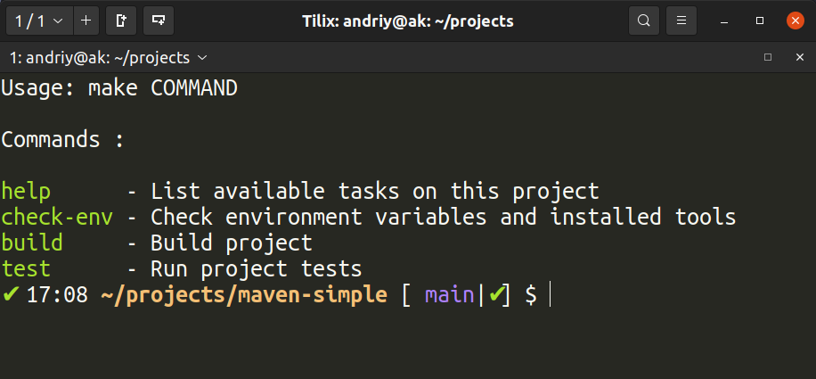

[](https://github.com/AndriyKalashnykov/maven-simple/actions/workflows/test.yml)
[](https://hits.seeyoufarm.com)
[](https://opensource.org/licenses/MIT)
# Maven based Java project for general purpose testing</br>

## Pre-requisites

- [sdkman](https://sdkman.io/install)

    Install and use JDK 17

    ```bash
    sdk install java 17.0.2-tem
    sdk use java 17.0.2-tem
    ```
- [Apache Maven](https://maven.apache.org/install.html)

    Install Apache Maven 3.8.4

    ```bash
    sdk install maven 3.8.4
    sdk use maven 3.8.4
    ```
- [`GNU Make`](https://www.gnu.org/software/make/)


**This [package](https://github.com/AndriyKalashnykov/maven-simple/tree/main/src/main/java/http/client) has example code** for a few HTTP clients in Java

CORE JAVA:
* HttpURLConnection
* HttpClient

POPULAR LIBRARIES:
* ApacheHttpClient
* OkHttp
* Retrofit

This [package](https://github.com/AndriyKalashnykov/maven-simple/tree/main/src/main/java/jsonparse/) contains examples 
of how to work with JSON in Java using 
* [Jackson](https://github.com/FasterXML/jackson) 
* [Gson](https://github.com/google/gson)

### Help

```bash
make help
```


