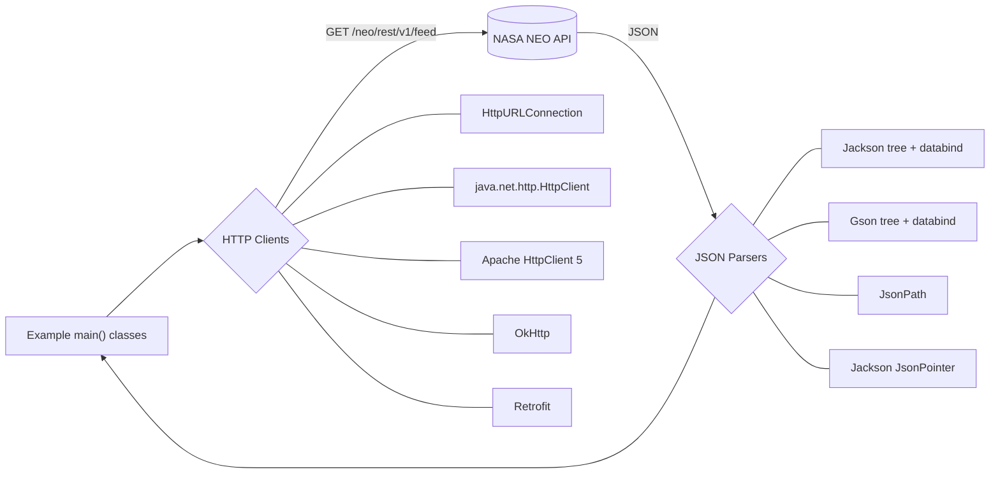

[](https://github.com/AndriyKalashnykov/maven-simple/actions/workflows/ci.yml)
[](https://hits.sh/github.com/AndriyKalashnykov/maven-simple/)
[](https://opensource.org/licenses/MIT)
[](https://app.renovatebot.com/dashboard#github/AndriyKalashnykov/maven-simple)

# Java HTTP Clients & JSON Parsing Reference

Side-by-side comparison of five Java HTTP clients (`HttpURLConnection`, `java.net.http.HttpClient`, Apache HttpClient 5, OkHttp, Retrofit) and four JSON-parsing approaches (tree model, simple data binding, full-schema data binding, path queries). Every implementation calls NASA's Near-Earth Objects (NEO) API with the same request and asserts the same response, so library trade-offs — ergonomics, dependency footprint, async support, schema handling — are directly visible.


```mermaid
flowchart LR
    App["Example main() classes"] --> HC{HTTP Clients}
    HC -->|"GET /neo/rest/v1/feed"| API[("NASA NEO API")]
    API -->|JSON| JP{JSON Parsers}
    JP --> App

    HC --- HC1[HttpURLConnection]
    HC --- HC2["java.net.http.HttpClient"]
    HC --- HC3[Apache HttpClient 5]
    HC --- HC4[OkHttp]
    HC --- HC5[Retrofit]

    JP --- JP1["Jackson tree + databind"]
    JP --- JP2["Gson tree + databind"]
    JP --- JP3[JsonPath]
    JP --- JP4[Jackson JsonPointer]
```

## Tech Stack

| Component | Technology |
|-----------|------------|
| Language | Java 25 LTS (Temurin via [mise](https://mise.jdx.dev/)) |
| Build | [Maven](https://maven.apache.org/) 3.9.15 (pinned via `.mise.toml`; enforcer allows 3.6.3+) |
| Tests | [JUnit Jupiter](https://junit.org/junit5/) 6.0.3 (unit) + [WireMock](https://wiremock.org/) 3.13.1 (integration via Failsafe `*IT.java`) |
| Coverage | [JaCoCo](https://www.jacoco.org/jacoco/) (70% instruction + branch) |
| HTTP clients | `java.net.HttpURLConnection`, `java.net.http.HttpClient`, [Apache HttpClient 5](https://hc.apache.org/) 5.6.1, [OkHttp](https://square.github.io/okhttp/) 5.3.2, [Retrofit](https://square.github.io/retrofit/) 3.0.0 |
| JSON | [Jackson](https://github.com/FasterXML/jackson) 3.1.2 (`tools.jackson.core`), [Gson](https://github.com/google/gson) 2.14.0, [JsonPath](https://github.com/json-path/JsonPath) 3.0.0 |
| Formatting | [google-java-format](https://github.com/google/google-java-format) |
| Security | [gitleaks](https://github.com/gitleaks/gitleaks), [Trivy](https://github.com/aquasecurity/trivy), [OWASP dependency-check](https://dependency-check.github.io/DependencyCheck/) |
| CI | GitHub Actions; local replay via [act](https://github.com/nektos/act) |
| Automation | [Renovate](https://docs.renovatebot.com/) (platform automerge) |

## Quick Start

```bash
make deps      # auto-install mise + Java/Maven pinned in .mise.toml
make build     # build the project
make test      # run all tests
make ci        # or run the full CI pipeline (static-check, test, coverage-check, build)
```

## Prerequisites

| Tool | Version | Purpose |
|------|---------|---------|
| [GNU Make](https://www.gnu.org/software/make/) | 3.81+ | Build orchestration |
| [Git](https://git-scm.com/) | 2.0+ | Version control, releases |
| [JDK](https://adoptium.net/) | 25+ | Java runtime and compiler (source: `.java-version`) |
| [Maven](https://maven.apache.org/) | 3.6.3+ | Build and dependency management (3.9.15 pinned in `.mise.toml`) |
| [mise](https://mise.jdx.dev/) | latest | Java/Maven version manager (auto-installed by `make deps`) |
| [Docker](https://www.docker.com/) | latest | Required by `act` for local CI |
| [act](https://github.com/nektos/act) | 0.2.87+ | Local CI runner for `make ci-run` (installed via `make deps-act`) |

Install everything:

```bash
make deps
```

## Architecture

Two independent module areas under `src/main/java/`:

### [HTTP Clients](src/main/java/http/client)

| Implementation | Package | Notes |
|----------------|---------|-------|
| [HttpURLConnection](src/main/java/http/client/java/JavaHttpURLConnectionDemo.java) | `java.net` | Core JDK, low-level |
| [java.net.http.HttpClient](src/main/java/http/client/java/JavaHttpClientDemo.java) | `java.net.http` | Modern JDK (Java 11+), async-capable |
| [Apache HttpClient 5](src/main/java/http/client/apache/ApacheHttpClientUserDemo.java) | `org.apache.httpcomponents.client5` | Long-standing library, fluent API |
| [OkHttp](src/main/java/http/client/okhttp/OkHttpDemo.java) | `com.squareup.okhttp3` | Square's HTTP stack |
| [Retrofit](src/main/java/http/client/retrofit) | `com.squareup.retrofit2` | Type-safe REST over OkHttp, Gson converter |

Shared models live under `http/client/model/`.

### [JSON Parsing](src/main/java/jsonparse)

| Approach | Package | Library |
|----------|---------|---------|
| Tree model | `jsonparse/treemodels/` | Jackson `JsonNode`, Gson `JsonElement` |
| Data binding — simple | `jsonparse/databinding/simple/` | Jackson + Gson POJO mapping |
| Data binding — complex | `jsonparse/databinding/complex/` | Generated model classes (`jackson/generated/`, `gson/generated/`) |
| Path queries | `jsonparse/pathqueries/` | JsonPath + Jackson JsonPointer |

## Usage

### Run a single example

Each HTTP client and JSON-parsing approach has a matching `*Test.java` (Surefire, unit) and — where applicable — an `*IT.java` (Failsafe, WireMock-stubbed):

```bash
# run a single unit test
mvn -B test -Dtest=OkHttpDemoTest -Ddependency-check.skip=true

# run all WireMock-stubbed integration tests
make integration-test
```

### Run a CVE scan locally

`make cve-check` scans dependencies for known vulnerabilities using two data sources:

- **[NVD](https://nvd.nist.gov/)** — NIST National Vulnerability Database. Without an API key, requests are rate-limited and the scan may fail with a 429 error.
- **[OSS Index](https://ossindex.sonatype.org/)** — Sonatype's vulnerability database; provides additional coverage beyond NVD. Authentication is required — without credentials the analyzer is skipped.

```bash
export NVD_API_KEY=<nvd-api-key>
export OSS_INDEX_USER=<ossindex-account-email>
export OSS_INDEX_TOKEN=<ossindex-api-token>
make cve-check
```

Both the NVD API key and OSS Index credentials are written to `~/.m2/settings.xml` by the `maven-settings-ossindex` prerequisite of `cve-check`, then referenced by id (`-DnvdApiServerId=nvd`) — secret values never enter Maven's argv (visible to local users via `ps -ef`).

## Make Targets

Listed below; `make help` prints the same list.

### Build

| Target | Description |
|--------|-------------|
| `make build` | Build project (skips tests and OWASP dependency-check) |
| `make clean` | Cleanup |

### Testing

| Target | Description |
|--------|-------------|
| `make test` | Run project tests (unit, fast) |
| `make integration-test` | Run integration tests (WireMock-stubbed HTTP clients; `*IT.java`) |
| `make coverage-generate` | Generate JaCoCo coverage report |
| `make coverage-check` | Verify code coverage meets 70% threshold |
| `make coverage-open` | Open code coverage report |

### Code Quality

| Target | Description |
|--------|-------------|
| `make lint` | Validate project configuration and check compiler warnings |
| `make format` | Format Java sources with google-java-format |
| `make format-check` | Verify Java sources are formatted |
| `make secrets` | Scan repository for hardcoded secrets (gitleaks) |
| `make trivy-fs` | Filesystem vulnerability/secret/misconfig scan |
| `make mermaid-lint` | Validate Mermaid diagrams in Markdown (requires Docker) |
| `make static-check` | Composite fast quality gate (format-check + lint + secrets + trivy-fs + mermaid-lint + deps-prune-check) |
| `make cve-check` | Run OWASP dependency vulnerability scan |
| `make vulncheck` | Alias for `cve-check` |

### CI

| Target | Description |
|--------|-------------|
| `make ci` | Run full CI pipeline (static-check, test, coverage-check, build) |
| `make ci-run` | Run GitHub Actions workflow locally using [act](https://github.com/nektos/act) |

### Dependencies

| Target | Description |
|--------|-------------|
| `make deps` | Check tools; auto-install mise (no root) and mise-pinned Java/Maven |
| `make deps-install` | Install Java and Maven via mise (reads `.mise.toml`) |
| `make deps-maven` | Install Maven into `~/.local` (CI fallback) |
| `make deps-act` | Install `act` into `~/.local/bin` |
| `make deps-gitleaks` | Install `gitleaks` into `~/.local/bin` |
| `make deps-trivy` | Install `trivy` into `~/.local/bin` |
| `make deps-check` | Show required tools and installation status |
| `make deps-updates` | Print available dependency updates |
| `make deps-update` | Update dependencies to latest releases |
| `make deps-prune` | Analyze declared-but-unused / used-but-undeclared dependencies |
| `make deps-prune-check` | Fail build on declared-but-unused dependencies |

### Utilities

| Target | Description |
|--------|-------------|
| `make release VERSION=x.y.z` | Tag and push a release |
| `make maven-settings-ossindex` | Create Maven settings for OSS Index credentials |
| `make renovate-bootstrap` | Install mise + Node for Renovate |
| `make renovate-validate` | Validate Renovate configuration |
| `make help` | List available tasks |

## CI/CD

GitHub Actions runs on every push to `main`, tags `v*`, pull requests, a weekly schedule (Monday 06:00 UTC for `cve-check`), and manual dispatch. The workflow also exposes `workflow_call` for reuse.

| Job | Triggers | Runs |
|-----|----------|------|
| `changes` | every event | [`dorny/paths-filter`](https://github.com/dorny/paths-filter) detector — gates heavy jobs so doc-only changes skip CI without deadlocking the `ci-pass` required check |
| `static-check` | after `changes` (when code changes) | `make static-check` (format-check + lint + gitleaks + Trivy filesystem scan + mermaid-lint + deps-prune-check) |
| `test` | after `changes` + `static-check` | `make coverage-check` (transitively runs tests + `jacoco:report`; uploads `coverage-report` artifact) |
| `integration-test` | after `changes` + `static-check` | `make integration-test` (WireMock-stubbed HTTP client tests) |
| `build` | after `changes` + `static-check` | `make build` |
| `cve-check` | tags `v*`, weekly schedule, manual dispatch | `make cve-check` with cached NVD database (uploads `cve-report` artifact) |
| `ci-pass` | after all of the above | Single gate for branch protection |

Pipeline: `changes` → `static-check` → `test` + `integration-test` + `build` (parallel); `cve-check` runs on release tags, the weekly schedule, and manual dispatch. `ci-pass` aggregates every required job so branch protection needs only one check, and treats skipped jobs (doc-only PRs) as success.

### Required Secrets

| Secret | Required by | Purpose |
|--------|-------------|---------|
| `NVD_API_KEY` | `cve-check` | Avoid NVD rate limits — [request one](https://nvd.nist.gov/developers/request-an-api-key) |
| `OSS_INDEX_USER` | `cve-check` | OSS Index account email — [register](https://ossindex.sonatype.org/user/register) |
| `OSS_INDEX_TOKEN` | `cve-check` | OSS Index API token from account settings |

Set secrets via **Settings > Secrets and variables > Actions > New repository secret**.

[Renovate](https://docs.renovatebot.com/) keeps dependencies up to date with platform automerge enabled.

## Contributing

Contributions welcome — open a PR. Review routing is configured via [CODEOWNERS](.github/CODEOWNERS).

## License

Released under the [MIT License](LICENSE).
